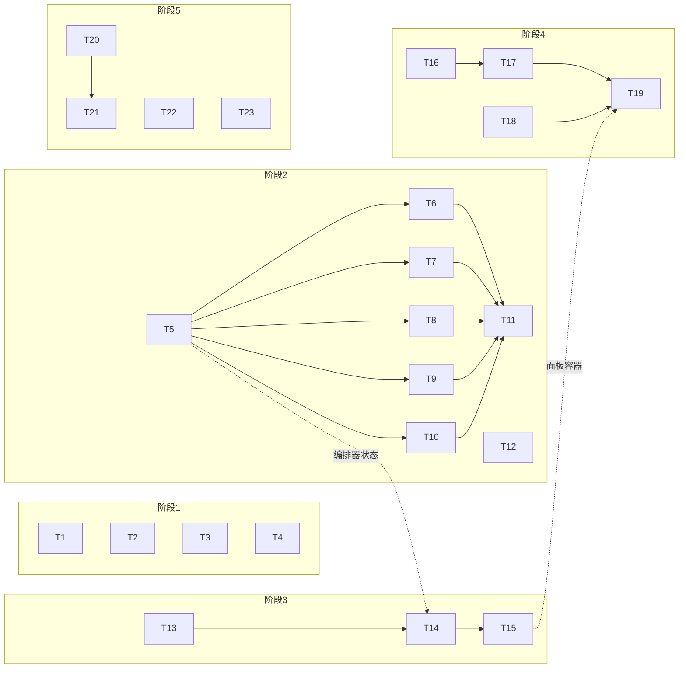

# MindFS 二开第二轮 开发计划

> 对应需求：[round2-prd.md](./round2-prd.md)　|　设计：[round2-design.md](./round2-design.md)　|　生成日期：2026-08-22
>
> 任务粒度按"一个任务 = 一个可独立提交/revert 的 PR"拆分（PRD N-5）。工作量按第一轮实际速度估算（人日为碎片时间日）。

## 1. 阶段总览与依赖

| 阶段 | 内容 | 任务 | 估算 | 准入条件 |
|---|---|---|---|---|
| 1 | 速赢小修包（P0） | T1–T4 | ~1 人日 | 无 |
| 2 | 优雅退出与进程治理（P0） | T5–T12 | ~4 人日 | 无（T12 可与阶段 1 并行） |
| 3 | 远程可观测（P1） | T13–T15 | ~2 人日 | 阶段 2 完成（诊断 API 依赖编排器提供 started_at 等状态） |
| 4 | 备份导出（P1） | T16–T19 | ~2.5 人日 | 阶段 3 的 T15（面板容器）完成 |
| 5 | 定时任务与通知（R-6.1/6.2 为 P1，其余 P2） | T20–T23 | ~1.5 人日 | 无硬依赖，可穿插 |

**建议实施顺序**：T1→T4（半天见效，验证链路）→ T12（独立、低风险，先落原子写保护）→ T5→T11（核心，按序）→ T13→T15 → T16→T19 → T20 →（余量再做 T21–T23）。

---

## 2. 阶段 1：速赢小修包

### T1　ErrorBoundary 接线 + fatal toast 兜底【R-2.1 / R-2.2】

- **改动位置**：`web/src/App.tsx`（两处 JSX 包裹）、`web/src/components/Toast.tsx:16-21`。
- **要点**：主视图渲染区包 `MainViewErrorBoundary`、抽屉面板区包 `DrawerPanelErrorBoundary`（组件已存在于 `ErrorBoundary.tsx:143,158`，零新实现）；移除 Toast 对 fatal 的 `return` 过滤，fatal 渲染为无自动超时、需手动关闭、视觉加重的持久条目。
- **DoD**：主视图内人为抛渲染错误显示降级 UI 且"重试"可恢复；抽屉崩溃不影响主视图；report fatal 后出现持久提示；`make typecheck` 与现有 web 测试全绿。
- **测试要点**：新增 `web/tests/` vm 沙箱测试覆盖 Toast 的 fatal 分支（持久、不自动消失）；ErrorBoundary 隔离域用开发模式手工验证并在 PR 描述附截图。

### T2　`agents-env.json` 权限收紧【R-3.1】

- **改动位置**：`server/internal/api/agent_config.go:728`（写入权限 0644 → 0600）。
- **DoD**：Unix 上新写文件权限 0600；Windows 沿用平台跳过约定（fork-plan 阶段 0.5 先例）。
- **测试要点**：权限断言测试按 `runtime.GOOS` 跳过 Windows；确认既有 agent 配置备份/切换测试不回归。

### T3　删除会话清理 `.debug.jsonl`【R-3.2】

- **改动位置**：`server/internal/session/manager.go:1069-1086`（`deleteSessionUnsafe` 的文件删除清单补第三个路径，路径常量在 `agent/logs/agentlog.go:14`）。
- **DoD**:单删、批量删、级联删子会话三条路径均不残留该 key 的 debug 文件；文件不存在时不报错。
- **测试要点**：在 manager 测试中造一个带 debug 文件的会话删除后断言目录内零残留；批量删除复用 `session_batch_delete_test.go` 基建加一例。

### T4　`session.error` 通知【R-2.3】

- **改动位置**：`server/internal/notify/notify.go`（新增 error payload builder）、`server/internal/api/appcontext.go:882`（`BroadcastSessionError` 内调用 `notifyPayload`）。
- **要点**：正文取错误摘要；事件 ID 沿用 session+seq 去重口径；对 `scheduled:` 前缀 requestID 跳过（对齐 `appcontext.go:932-934`，避免与 `scheduled.failed` 双推）。Service Worker 无需改动。
- **DoD**：会话出错时 Web Push 与 notify-script 均收到 `type: "session.error"`；30 分钟内同一事件不重复；定时任务失败只收到 `scheduled.failed` 一条。
- **测试要点**：notify 包单测覆盖 builder 字段；appcontext 层用假 notifier 断言触发与豁免两条路径。

---

## 3. 阶段 2：优雅退出与进程治理

### T5　退出编排器 + CLI 等待竞态修复【R-1.1 骨架】

- **改动位置**：新文件 `server/app/shutdown.go`；`server/app/server.go`（废除 192-197 旁路协程，Serve 返回后同步执行编排）；`cli/cmd/mindfs.go:367-375`（信号分支改为继续等待 `errCh`）。
- **要点**：closer 注册栈（LIFO、带名字、逐步日志、总预算 10s 看门狗，超时非 0 退出码），见设计 §2.1–2.2。本任务只搬运现有三个关闭动作（prober/pool/http.Shutdown 带 3s 子超时）进编排器，资源补齐由 T6–T10 各自注册。
- **DoD**：Unix `kill -TERM` 后日志出现完整关闭序列且 10s 内退出；`mindfs-server` 前台 Ctrl-C 同效；看门狗路径有测试或手工验证记录。
- **测试要点**：编排器单测（LIFO 顺序、单步 panic 不中断后续、看门狗触发）；`server_test.go` 现有用例全绿。**这是后续所有任务的地基，必须先合入。**

### T6　HTTP/WS 停止完善

- **改动位置**：`server/internal/api/`（StreamHub 新增全连接关闭能力）、编排器注册。
- **要点**：hijacked 的 `/ws` 不受 `http.Server.Shutdown` 管辖（设计 §2.2 步 2）；StreamHub 懒建（`appcontext.go:781`），关闭动作需容忍未创建。
- **DoD**：有活跃 WS 连接时退出不卡满预算，连接被主动断开；前端断线重连逻辑不受影响（重启后自动恢复，沿用现有 `connection.ts` 行为）。
- **测试要点**：带活跃 WS 的退出耗时测试；前端手工验证重启后 UI 自动恢复。

### T7　AppContext / scheduled / kanban 关闭接线 + 启动侧 running 收敛

- **改动位置**：`server/internal/api/appcontext.go`（新增全量 Close，复用 `ReleaseRootResources` 逻辑，`appcontext.go:636-654`）；scheduled 停止改为等待 `cron.Stop()` 返回的 context（上限 5s，`scheduled/tasks.go:143`）；`kanban.Service.Close()` 注册进编排器；kanban 启动加载时把遗留 `running` 的 stage run 标记为中断终态（设计 §2.2 末段）。
- **DoD**：退出后各 root 的 sqlite 句柄与 watcher 全部释放（Windows 上退出后可立即删除 `.mindfs/` 验证）；正在执行的 cron job 在 5s 内被等到或放弃；强杀后重启，看板无 `running` 遗留。
- **测试要点**：AppContext 全量 Close 测试沿用阶段 0.5 的 `newTestManager` 辅助基建；kanban 启动收敛加一例（预置 running 行 → 启动 → 断言中断态）；Windows CI 必须绿（文件句柄问题只在 Windows 暴露）。

### T8　agent Pool / claude Runtime 关闭补齐

- **改动位置**：`server/internal/agent/claude/session.go:60-64,174`（Runtime 增加活跃会话注册表、`CloseAll` 落地）、`server/internal/agent/pool.go:500-523`（`CloseAll` 先逐 session Close 再清 map）。
- **要点**：不改 SDK fork（设计 §2.3）；Close 幂等，SDK Close 二次调用需验证无 panic。
- **DoD**：退出后无 claude CLI 残留进程（Windows 任务管理器 / Unix `ps` 验证并记录在 PR）；`agent` 包测试全绿。
- **测试要点**：Runtime 注册表单测（登记/注销/CloseAll 幂等）；真实 claude 会话的进程消失验证为手工回归项（写入 PR checklist）。

### T9　commandexec 全局关闭 + Windows 进程树修正

- **改动位置**：`server/internal/commandexec/long_shell.go`（新增包级全局关闭入口，遍历 sessions 复用 `CloseSession` 终止逻辑）；`server/internal/agent/acp/process_windows.go:11-16`（`killProcessTree` 改为真正杀进程树）。
- **要点**：本轮不改 ctx 传递链（设计 §2.3 已记取舍）；Windows 进程树终止方案见设计 §2.3 末行。
- **DoD**：退出后长驻 shell 及其子进程无残留（Windows 上在 shell 里启动一个 sleep 子进程再退出验证）；ACP agent 的孙进程同验证。
- **测试要点**：commandexec 全局关闭单测（多 session 全关、幂等）；Windows 进程树终止在 Windows CI + 本机手工双验证。

### T10　relay.Manager 导出 Stop

- **改动位置**：`server/internal/relay/manager.go:41-59`（导出 Stop：内部 cancel + 主动关 WS 长连）、编排器注册。
- **DoD**：退出时中继端立即感知下线（relay 面板节点状态），无 goroutine 泄漏告警。
- **测试要点**：relay 包测试全绿；注意 fork-plan 阶段 0.5 记录的上游测试隔离缺陷（`TestManagerPollTerminalBindStatusStopsPolling` 单独 -run 必挂），新测试不要依赖包内执行顺序。

### T11　Windows 关机端点 + CLI 接入 + 自更新走退出链【R-1.2 / R-1.3】

- **改动位置**：`api/http.go`（注册 `POST /api/shutdown`，handler 放 `server/app` 侧注入）、`server/app/local_cli_token.go`（复用鉴权）、`cli/cmd/mindfs.go:605-629`（`stopService` 先 API 后 taskkill，轮询放宽到 12s）、`server/internal/update/service.go:749-772`（`os.Exit(0)` 改为调用注入的"请求退出"回调，顺序反转为先关后 spawn，设计 §2.5）。
- **DoD**：R-1.2 验收①②③全过；R-1.3 验收①②全过（Windows + Unix 各真实走一次 Web 触发更新）。
- **测试要点**：鉴权测试三例（无 token 403 / 错 token 403 / 非 loopback 拒绝）；`-stop` 回退路径测试（模拟服务无响应）；自更新回归为手工 checklist（两平台各一次，验证会话数据与 registry.json 无损）。**本任务是阶段 2 收尾，依赖 T5–T10 全部合入。**

### T12　原子写 helper + 9 处替换【R-1.4】（独立任务，可提前并行）

- **改动位置**：helper 落 `server/internal/config`（对齐 `fs.WriteMetaFile` 语义，支持权限位）；替换 9 处清单见设计 §3 表格（含 T2 已改权限的 `agent_config.go:728`，统一收编）。
- **要点**：Windows rename 覆盖被占用文件需一次短重试；失败保留 tmp、不碰目标文件。
- **DoD**：9 处全部走 helper；全部相关包测试双平台绿。
- **测试要点**：helper 单测（原子性——写入中断目标文件保持旧内容、权限位、Windows 重试路径）；`fs/registry_test.go` 既有 6 例回归。

---

## 4. 阶段 3：远程可观测

### T13　运行期日志轮转 + 按地址分文件【R-4.1】

- **改动位置**：`cli/cmd/mindfs.go`（日志文件命名带 addr、`startBackgroundProcess` 重定向改指 `.stderr` 兜底文件、`-status` 输出新路径）、新增轮转 writer（服务进程内 `log.SetOutput`，滚动语义复用 `mindfs.go:543-572`）、`cli/cmd/autostart_unix.go:116-117`（launchd 的 std 路径指向 `.stderr`）。
- **要点**：日志所有权移入服务进程（设计 §5.1）；轮转 writer 加锁；`.stderr` 启动时截断、不轮转。
- **DoD**：R-4.1 验收①②③全过（阈值可在测试中调小验证滚动）；`-status` 显示的路径真实存在。
- **测试要点**：轮转 writer 单测（跨阈值滚动、`.1/.2/.3` 链、并发写安全）；双实例分文件用集成测试或手工验证记录；macOS launchd 场景手工验证（唯一无 CI 覆盖的平台，写入 PR checklist）。

### T14　`/api/logs` + `/api/diagnostics`【R-4.2 / R-4.3 后端】

- **改动位置**：新 handler（建议落 `server/internal/api/` 新文件）+ `http.go` 路由注册；diagnostics 聚合需要编排器/Start 暴露 `started_at`、各服务暴露只读状态（webpush 已有 `service.go:362` 可复用）。
- **要点**：logs 从文件尾反向读块（不整文件载入），默认 200 行上限 2000；diagnostics 只读内存态，响应 < 500ms（PRD N-4）；两端点走既有 `/api/*` 会话鉴权。
- **DoD**：字段与设计 §5.2 表一致；Relay 远程访问可用；超长单行日志不炸响应（截断策略）。
- **测试要点**：尾部读取单测（空文件、单行超长、恰好跨块边界、lines 超上限钳制）；diagnostics 字段快照测试。

### T15　前端诊断面板【R-4.2 / R-4.3 前端】

- **改动位置**：新组件 `web/src/components/DiagnosticsPanel.tsx`、新服务 `web/src/services/diagnostics.ts`；入口接线 `FileTree.tsx` 菜单区一项 + `App.tsx` 挂载点（最小 diff）。
- **要点**：三分区结构（状态总览 / 日志尾部 / 存储与备份，第三区先留占位由 T19 填充）；日志区等宽 + 横向滚动防破版；移动端可用（BottomSheet 容器复用）。
- **DoD**：手机远程可查看状态与日志并刷新；`typecheck` 绿；i18n 双语词条齐全。
- **测试要点**：`diagnostics.ts` 纯逻辑（响应解析、行截断）进 vm 沙箱测试；UI 手工验证桌面 + 移动两档宽度并附截图。

---

## 5. 阶段 4：备份导出

### T16　sqlite 一致性快照能力【R-5.1 前置】

- **改动位置**：`server/internal/session/manager.go`（新增快照导出方法，内部 `VACUUM INTO`）、`server/internal/kanban`（task store 同款）。
- **要点**：经既有单连接执行（`SetMaxOpenConns(1)` 天然与写互斥）；目标必须是不存在的新路径；失败降级语义留给 T17 处理。
- **DoD**：快照文件可独立打开且含全部行；导出期间并发写入不失败、不损坏。
- **测试要点**：并发写 + 快照的竞态测试；快照文件用独立连接打开校验行数；Windows 路径（临时文件删除）复用 `newTestManager` 清理基建。

### T17　backup 包 + 导出端点【R-5.1 / R-5.2 / R-5.4 后端】

- **改动位置**：新包 `server/internal/backup`；`http.go` 注册 `POST /api/backup/export`；usecase 层转发沿用可选接口断言模式（设计 §8）。
- **要点**：三处存储覆盖规则与 `.link` 解析（设计 §4.2）；zip 布局与 manifest 字段（设计 §4.3）；凭据排除清单；`commands/history.db` 直接 copy 并在 manifest 标注；`RESTORE.md` 模板作为包内静态资源。
- **DoD**：R-5.1 验收①②③全过；**R-5.2 恢复验证**——project / home / `.link` 兜底三种布局各恢复一次全数据可见（发布硬门槛，PR 描述必须附三次恢复的验证记录）。
- **测试要点**：backup 包单测覆盖布局枚举（三种 meta 布局 × 有无 fallback db × 含/不含凭据）；zip 内容断言用清单比对；恢复流程按 `RESTORE.md` 手工执行并记录。

### T18　存储体检与清理端点【R-5.3】

- **改动位置**：`server/internal/backup`（或同包 storage 部分）+ `http.go` 两条路由。
- **要点**：孤儿 debug 判定 = key 不在 `sessions` 表；journal 只做"安全回收"（打开-关闭对应 DB 触发回滚），绝不直接删（设计 §4.4）；报表字段见设计 §4.4。
- **DoD**：R-5.3 验收①②③全过。
- **测试要点**：孤儿判定测试（活跃 key 的 debug 不误报）；journal 回收测试（预置 journal → 回收 → 消失且 DB 数据完好）；体积报表抽样与 `os.Stat` 对账。

### T19　前端备份/体检区【R-5.4 前端】

- **改动位置**：`DiagnosticsPanel.tsx` 第三分区填充；`diagnostics.ts` 增导出/体检调用。
- **要点**：导出按钮（scope 选择 + 凭据 checkbox + 明示提醒文案）触发下载流；体检报表展示 + 清理确认；移动端下载兼容（浏览器直接下载语义）。
- **DoD**：R-5.4 验收通过；手机端可完成一次完整导出。
- **测试要点**：排除凭据选项的端到端验证（解包检查清单）；i18n 双语；提醒文案需人工过目。

---

## 6. 阶段 5：定时任务与通知（P1 头部 + P2）

### T20　scheduled 执行超时 + 跳过不覆盖错误【R-6.1 / R-6.2】

- **改动位置**：`server/internal/scheduled/tasks.go:326`（WithTimeout，默认 60 分钟）、任务结构体加可选超时字段与 `last_skipped_at`（`tasks.go:415-425` 跳过路径改写目标）；`ScheduledAgentTaskDialog.tsx` 增超时输入与跳过信息展示。
- **要点**：JSON 向后兼容（缺省字段走默认）；超时中断走与手动停止一致的取消链（设计 §9 末行）。
- **DoD**：R-6.1 / R-6.2 验收全过；旧 `scheduled-agent-tasks.json` 文件可直接读。
- **测试要点**：超时释放 `running` 锁的测试（假 SendMessage 挂起）；跳过后 `LastError` 保留真实错误的断言；旧格式文件加载兼容测试。

### T21　scheduled 执行历史 + cron 友好性【R-6.3 / R-6.4，P2】

- **改动位置**：`tasks.go`（history 环形 20 条、解析器加 `cron.Descriptor`、`decorateTask` 时区统一 UTC，`tasks.go:119,589`）；`ScheduledAgentTaskDialog.tsx`（历史折叠列表、descriptor 校验放宽，`:91`）。
- **DoD**：R-6.3 / R-6.4 验收全过。
- **测试要点**：环形淘汰边界（第 21 条）；`@daily` 解析与触发；Next/Last 时区一致性断言。

### T22　通知 i18n + notify-script 契约文档【R-7，P2】

- **改动位置**：`server/internal/notify/notify.go`（builder 加语言参数 + 包内词条表）、调用方取用户界面语言；文档 `docs/notify-script.md`（payload 字段全表 + 5 种事件类型）+ `scripts/` 下 `.ps1` / `.sh` 示例各一（桌面通知转发）。
- **DoD**：界面切英文后推送为英文；示例脚本在对应平台可直接运行（PR 附运行截图）。
- **测试要点**：builder 双语言快照测试；示例脚本手工双平台验证。

### T23　单会话导出 Markdown【R-8，P2】

- **改动位置**：后端会话读取已有（exchange/aux 解析在 session 包），新增导出转换（建议落 usecase 层）+ 路由；前端会话菜单加导出项。
- **要点**：轮次结构、tool call 折叠为引用块；附件图片处理策略按 PRD R-8.1（相对路径随包或标注缺失）；范围守住"给笔记软件看"，不做样式定制。
- **DoD**：R-8.1 验收通过。
- **测试要点**：转换器单测（多轮、含 toolcall、含图片、空会话）；产物在 Typora/Obsidian 抽一验证。

---

## 7. 回归与发布

**每阶段合入前**：`make test`（Go 双平台走 CI + web vm 沙箱）+ `make typecheck` 全绿；提交粒度一任务一提交，遵循现有 commit message 风格（`feat(scope):` / `fix(scope):` 英文小写）。

**阶段 2 专项回归 checklist**（手工，两平台）：
1. `-stop` / `-restart` / Ctrl-C（前台）/ Web 触发更新，四条路径各一遍；
2. 每条路径后检查：残留进程（claude / node / shell 子进程）、`.mindfs/` 下 journal、kanban running 状态、`registry.json` 可解析；
3. 讯飞/搜狗 IME 回归不适用本轮（未触碰 ActionBar 键盘路径），跳过。

**发布判定**执行 PRD §5：P0 全过 + CI 双绿方可打 fork 版本；R-5.2 恢复验证是备份功能的发布硬门槛。

## 8. 上游同步注意事项（本轮特有）

| 冲突热点 | 缓解 |
|---|---|
| `server/app/server.go`（上游常动 Start） | 编排逻辑全在新文件 `shutdown.go`，server.go 只留注册行；合并冲突时以"上游结构 + 重挂注册"为解法 |
| `api/http.go` 路由表（上游每版都加路由） | 新路由集中一处追加，冲突面为纯追加行 |
| `update/service.go` 重启时序 | 若上游自行改造重启逻辑，以上游为准、重接"请求退出"回调即可 |
| `scheduled/tasks.go` 结构体加字段 | 新字段全部 `omitempty` 语义、命名避开上游常用词；合并时结构体字段冲突手工合 |
| `App.tsx` | 本轮仅 3 处接线级 diff（两处 ErrorBoundary 包裹 + 一处面板挂载），冲突风险可控 |
| 上游若实现同类功能（备份/退出/日志） | 每次 merge upstream 后 grep 对应能力，出现重叠时优先弃用 fork 实现（fork-plan 既定原则） |
